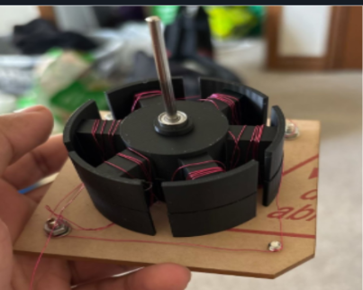
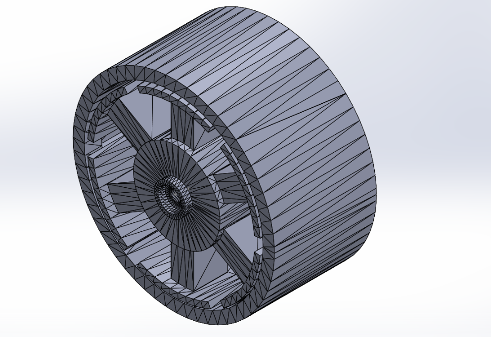
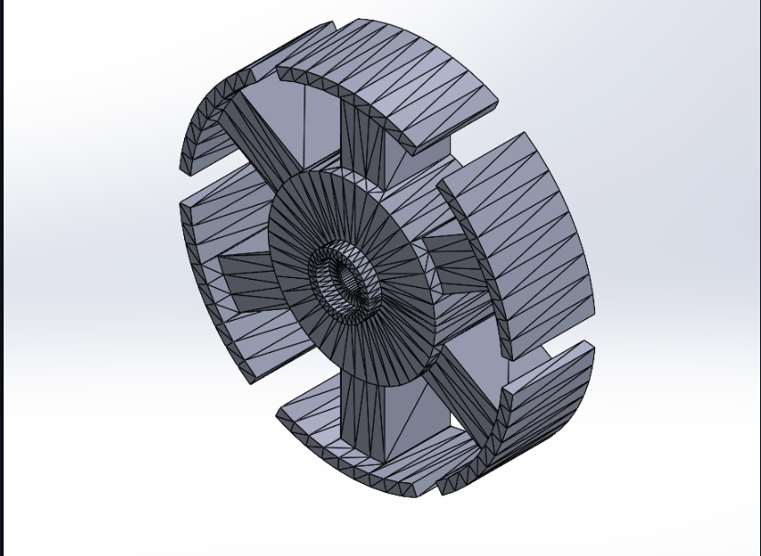
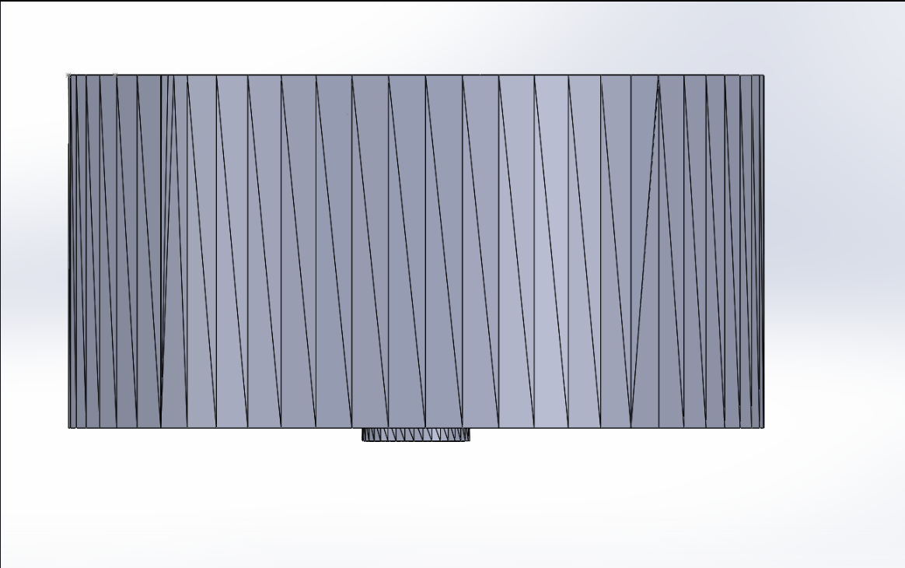

# BLDC Motor Design, Fabrication & Testing

A custom three-phase brushless DC (BLDC) motor designed, CAD-modelled, 3D printed, wound, assembled, and physically tested as an electromechanical engineering project.

The design was developed around a **15 V / 5 A (75 W) electrical input constraint**, with a target operating speed of **3,000 RPM**, target torque of **0.12 N·m**, and an **original estimated efficiency of ~63%**. The project combined electric-machine calculations, SolidWorks CAD, 3D-printed components, N52 neodymium magnets, copper windings, and a Wye-connected three-phase stator.

---

## Final Prototype



---

## Project Highlights

- Designed a custom **three-phase BLDC motor**
- Modelled the rotor, stator, and full assembly in **SolidWorks**
- Fabricated major structural components using **3D printing**
- Hand-wound the stator using copper magnet wire
- Integrated **N52 neodymium permanent magnets**
- Used a **Wye (Star) winding configuration**
- Assembled and physically tested the completed prototype
- Evaluated electrical, electromagnetic, and mechanical design considerations

---

## Design Specifications

| Parameter | Design Value |
|---|---:|
| Motor Type | Three-phase BLDC |
| Supply Voltage | 15 V |
| Maximum Design Current | 5 A |
| Maximum Electrical Input | 75 W |
| Target Speed | 3,000 RPM |
| Target Torque | 0.12 N·m |
| Original Estimated Efficiency | ~63% |
| Winding Connection | Wye / Star |
| Permanent Magnets | N52 Neodymium |
| CAD Software | SolidWorks |
| Fabrication Method | 3D Printing + Manual Assembly |

> **Note:** The original detailed calculation and measurement sheets are no longer available. The calculations below reconstruct the main engineering relationships from the original design targets. They are presented as design calculations, not preserved experimental measurements.

---

## Engineering Calculations

### Angular Velocity

Rotational speed can be converted from RPM to angular velocity using:

```text
ω = 2πN / 60
```

For the 3,000 RPM target:

```text
ω = 2π(3000) / 60
ω ≈ 314.2 rad/s
```

### Mechanical Power at the Target Operating Point

Mechanical power is related to torque and angular velocity by:

```text
P_mech = τω
```

Using the target torque and speed:

```text
P_mech = 0.12 × 314.2
P_mech ≈ 37.7 W
```

### Maximum Electrical Input

Electrical input power is:

```text
P_in = VI
```

At the 15 V / 5 A design limit:

```text
P_in = 15 × 5
P_in = 75 W
```

### Torque Constant

The torque constant relates electromagnetic torque to motor current:

```text
K_t = τ / I
```

### Back-EMF Relationship

Back electromotive force increases with rotor speed:

```text
E = K_eω
```

where:

- `E` = back EMF
- `K_e` = back-EMF constant
- `ω` = angular velocity

A numerical `K_t` or `K_e` value is not claimed here because the original calculation sheet is no longer available.

---

## CAD Design

The rotor, stator components, and full motor assembly were modelled in **SolidWorks** before fabrication.

The CAD stage was used to evaluate:

- overall motor geometry
- rotor/stator fit
- shaft alignment
- winding space
- magnet placement
- component clearances
- 3D-printing feasibility
- final assembly fit

### Full Assembly



### Stator / Internal Geometry



### Side View



The original native SolidWorks files are included in the repository:

```text
cad/
├── BLDC_Motor_Assembly.SLDASM
├── Rotor.SLDPRT
├── StatorTop.SLDPRT
└── StatorBottom.SLDPRT
```

---

## Electromagnetic Configuration

The motor used a three-phase stator with copper windings and **N52 neodymium permanent magnets** in the rotor.

The stator phases were connected in a **Wye (Star) configuration**.

The design process considered:

- target speed and torque
- voltage and current constraints
- winding requirements
- available winding space
- permanent-magnet placement
- rotor/stator geometry
- air-gap control
- back-EMF behaviour
- shaft and mechanical alignment

---

## Fabrication & Assembly

After the SolidWorks design was completed, the motor was physically fabricated and assembled.

The build process included:

1. CAD modelling of the rotor and stator
2. 3D printing of the structural components
3. Hand-winding the stator
4. Installing N52 permanent magnets
5. Connecting the stator phases in Wye
6. Installing the shaft and mechanical components
7. Completing the motor assembly
8. Mounting the prototype to a test base
9. Checking clearances, wiring, and alignment
10. Physically testing the completed motor


---

## Testing

The completed motor was physically tested after assembly.

Before operation, the prototype was checked for:

- rotor/stator clearance
- shaft alignment
- winding continuity
- phase connections
- magnet placement
- mechanical interference
- secure mounting
- supply-voltage/current limits

Testing was used to evaluate the prototype as a complete electromechanical system and identify differences between theoretical design targets and real-world performance.

Because the original detailed test sheet is no longer available, this repository intentionally distinguishes **design targets** from **verified measurements**.

---

## Engineering Lessons Learned

This project demonstrated that electric-machine performance depends on more than theoretical calculations.

Practical performance is also influenced by:

- manufacturing tolerances
- winding feasibility
- rotor/stator air gap
- magnet positioning
- shaft alignment
- mechanical friction
- material properties
- assembly quality

The project provided hands-on experience connecting:

**electromagnetic theory → electrical calculations → CAD → fabrication → winding → assembly → testing**

into one complete engineering system.

---

## Repository Structure

```text
BLDC-Motor-Design-and-Fabrication/
│
├── README.md
│
├── cad/
│   ├── BLDC_Motor_Assembly.SLDASM
│   ├── Rotor.SLDPRT
│   ├── StatorTop.SLDPRT
│   └── StatorBottom.SLDPRT
│
└── images/
    ├── physical_motor.jpg
    ├── full_assembly.png
    ├── stator_design.png
    └── side_view.png
```

---

## Skills Demonstrated

**Electrical Engineering**
- BLDC motor design
- Electric machines
- Electromagnetic design
- Three-phase windings
- Wye connection
- Back-EMF and torque-speed relationships

**CAD & Fabrication**
- SolidWorks
- 3D printing
- Component modelling
- Assembly modelling
- Prototype fabrication

**Engineering Process**
- Requirements definition
- Design calculations
- CAD development
- Fabrication
- Assembly
- Physical testing
- Design evaluation

---

## Future Improvements

Future work could include:

- measuring no-load and loaded RPM with a tachometer
- measuring voltage and phase current during operation
- measuring torque directly
- measuring back EMF
- generating speed-torque curves
- calculating efficiency from synchronized measurements
- improving rotor/stator air-gap tolerances
- improving shaft and bearing alignment
- refining winding space and copper fill
- comparing theoretical predictions with measured performance

---

## Summary

This project demonstrates the complete development of a custom BLDC motor from engineering requirements through physical implementation.

The motor was **designed in SolidWorks, fabricated using 3D-printed components, wound by hand, assembled with N52 permanent magnets, connected in a three-phase Wye configuration, and physically tested**. The original design targeted **3,000 RPM and 0.12 N·m torque** under a **15 V / 5 A (75 W) electrical constraint**, with an **estimated efficiency of ~63%**.

The project strengthened practical experience in **electric-machine design, electromagnetic calculations, CAD, prototyping, fabrication, and engineering testing**.
